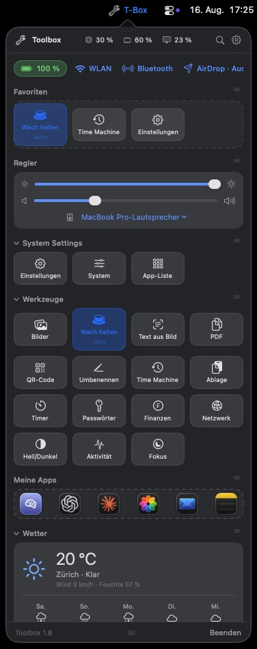
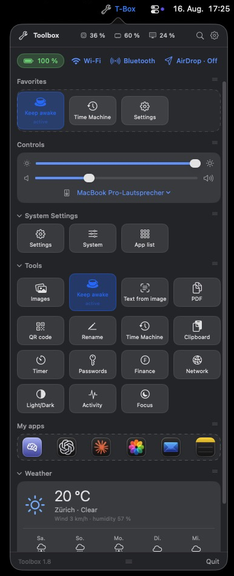
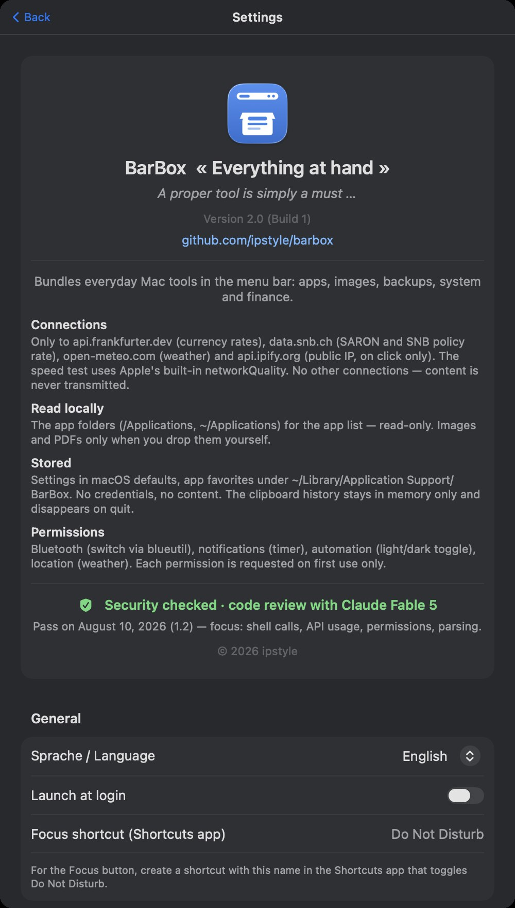

# Toolbox

*[English version →](README.md)*

Eine kostenlose, quelloffene **Menüleisten-Toolbox für macOS** — inspiriert von Parallels Toolbox, gebaut mit SwiftUI. Alles einen Klick entfernt: Desktops, Apps, Bilder, Backups, Systemregler, Wetter und Finanzen.

**Deutsch und Englisch** — umschaltbar in den Einstellungen.

<p align="center">
  
</p>
<p align="center">
  
  
</p>
<p align="center">
  
</p>

## Funktionen

- **Desktop-Wechsel** — per Klick direkt auf Desktop 1–9 (zeigt den aktiven Desktop)
- **Status-Chips** — Batterie, WLAN- und Bluetooth-Schalter, AirDrop-Modus, alles als Dropdown
- **Regler** — Display-Helligkeit, Lautstärke, Audio-Ausgabegerät
- **Favoriten** — die wichtigsten Werkzeuge und Schnellaktionen kombiniert, per Drag & Drop sortierbar; alle Sektionen einklappbar und verschiebbar
- **Werkzeuge**
  - Wach halten (unbegrenzt / 30 min / 1 h / 2 h)
  - Bilder komprimieren (AI-Preset 1568 px, halb so gross 50 %, JPEG-Ausgabe)
  - Text aus Bild (OCR, offline via Apple Vision)
  - PDFs zusammenfügen, QR-Code-Generator, Batch-Umbenennen mit Mustern
  - Zwischenablage-Verlauf (letzte 20, nur im Arbeitsspeicher)
  - Timer mit Mitteilung, Passwort/UUID-Generator
  - Netzwerk & Info: lokale/öffentliche IP, Internet-Speedtest (mit Historie), Systeminfo
  - Finanzen: CHF→EUR/USD-Rechner (EZB-Kurse), SARON & SNB-Leitzins
  - Time-Machine-Status & Backup-Start
  - Wetter: aktuell + 5-Tage-Vorhersage am Standort (MeteoSchweiz-Modell ICON via Open-Meteo)
- **App-Starter** — Apps aus dem Finder in «Meine Apps» ziehen, durchsuchbare Liste aller installierten Apps
- **Persistentes Fenster** — bleibt offen, bis du erneut aufs Menüleisten-Symbol klickst; Grösse einstellbar

## Installation

1. `Toolbox-x.y.zip` aus dem [neusten Release](../../releases/latest) laden und entpacken.
2. `Toolbox.app` nach `/Programme` (`/Applications`) verschieben.
3. **Erster Start:** Die App ist nicht notarisiert (hinter dem Projekt steht kein bezahltes Apple-Developer-Konto). macOS warnt darum — Rechtsklick auf die App → **Öffnen** → **Öffnen**. Alternativ:

```bash
xattr -d com.apple.quarantine /Applications/Toolbox.app
```

## Freigaben

Jede Freigabe wird erst beim ersten Gebrauch angefragt:

| Funktion | Freigabe |
|---|---|
| Desktop-Wechsel | Bedienungshilfen (simuliert Ctrl+1…9; die App kann diese Mission-Control-Kurzbefehle für dich aktivieren) |
| Bluetooth-Schalter | [blueutil](https://github.com/toy/blueutil) (`brew install blueutil`) + Bluetooth-Freigabe |
| Wetter | Ortung (oder Fallback-Ort in den Einstellungen) |
| Timer | Mitteilungen |
| Hell/Dunkel | Automation (System Events) |

## Privatsphäre

Keine Konten, kein Tracking, keine Analyse. Netzwerkverbindungen nur zu: `api.open-meteo.com` (Wetter), `api.frankfurter.dev` (Währungskurse), `data.snb.ch` (Schweizer Zinsen) und `api.ipify.org` (öffentliche IP, nur auf Klick). Der Speedtest nutzt Apples eingebautes `networkQuality`. Sonst verlässt nichts deinen Mac.

## Selbst bauen

Braucht nur die Xcode Command Line Tools (Swift 5.9+), kein Xcode-Projekt:

```bash
git clone https://github.com/ipstyle/toolbox.git
cd toolbox
./build.sh
open build/Toolbox.app
```

## Lizenz

[GPL-3.0](LICENSE) · © 2026 ipstyle
